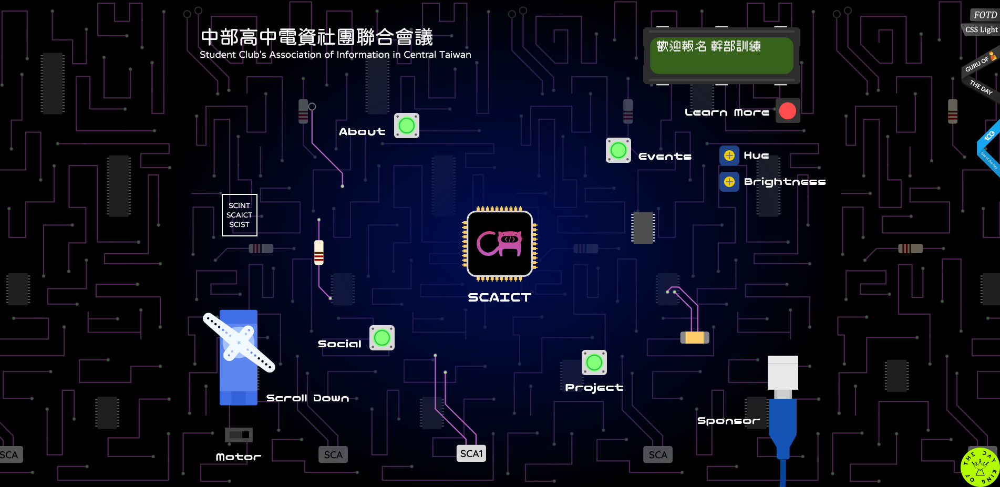

# 中電會官方網站

  

<https://scaict.org>

## 簡介 Introduction

這是中電會的官方網站，由中電會第三屆成員共同建立。使用純手工打造，不使用任何框架，可直接靜態部屬。資料存放於 [website-data](https://github.com/SCAICT/website-data) 倉庫。

This is the official website of SCAICT, built by the third generation of SCAICT members. It is built from scratch without any framework and can be deployed as a static website. Data is stored in the repo [website-data](https://github.com/SCAICT/website-data).

**編輯前請詳讀 [Wiki](https://github.com/SCAICT/website/wiki)**

## 獲獎 Awards

- [CSSLight](https://www.csslight.com/website/63649/Scaict) - Featured of the Day
- [Top Design King](https://topdesignking.com/website/1502/scaict) - King of the Day
- [Web Gugu Award](https://www.webguruawards.com/sites/scaict) - Guru of the Day
- [CSSREEL](https://www.cssreel.com/website/scaict) - Featured
- CSS WINNER - Nominee
- [Top CSS Gallery](https://www.topcssgallery.com/gallery/scaict/)
